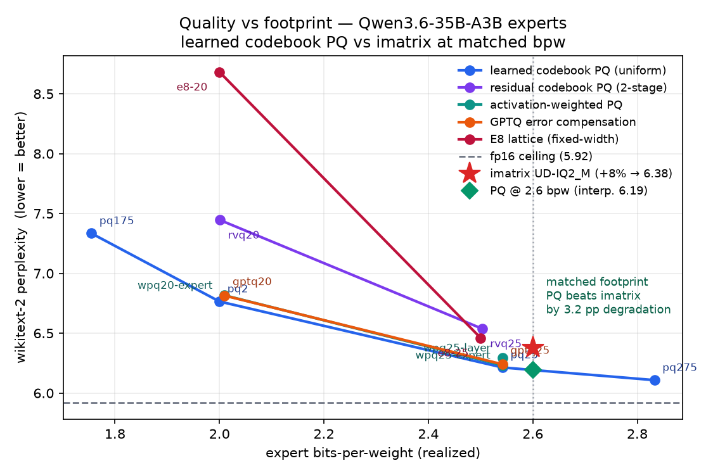

# bits-per-brain — codebook vs. imatrix quantization on a 3B-active MoE

> How few bits per weight before the "brain" stops working — and does *how* you spend
> those bits (learned codebook vs. importance matrix) matter more than the count?

## Question

At equal memory footprint, does a **learned-codebook** 2-bit quant (VPTQ / AQLM) beat
**scalar block quant + importance matrix** (Unsloth Dynamic GGUF) on a Mixture-of-Experts
model with a tiny active path?

Target model: [`Qwen/Qwen3.6-35B-A3B`](https://huggingface.co/Qwen/Qwen3.6-35B-A3B) —
35B total, **3B active** per token. Confirmed from `config.json`: `qwen3_5_moe`,
multimodal (`Qwen3_5MoeForConditionalGeneration`, vision tower + text stack), 40 decoder
layers, **256 experts, top-k 8**, `moe_intermediate_size` 512, one shared expert, hybrid
linear/full attention (Gated DeltaNet, full attention every 4th layer). Highest Artificial
Analysis Intelligence Index (32) of any 2026 open MoE that fits on a single A100-80GB for
*encoding*, and AA's designated efficiency leader — which is exactly what makes extreme
low-bit interesting: a tiny active path has the least redundancy to absorb quant error.

## Hypothesis

On **dense** models, codebook quant clearly wins at 2-bit (the published VPTQ/AQLM result).
On a **3B-active MoE** the edge should *shrink or vanish*, because importance-matrix
calibration is unusually strong here: expert usage is heavily skewed, so imatrix
automatically pours precision into the hot + shared experts. The interesting outcome is
either direction:

- **VPTQ wins** → codebook representation beats scalar even on the hardest MoE case → worth the encode cost.
- **VPTQ ties / loses** → imatrix's expert-aware allocation is what actually matters at this scale → cheaper methods suffice.

## The confound we must control

"Unsloth Dynamic imatrix" bundles **two** independent levers:

| Lever | Unsloth UD-IQ2 | Vanilla VPTQ/AQLM |
|---|---|---|
| Weight representation | scalar, per-block | learned codebook |
| Bit allocation | **dynamic** (per-layer, importance-driven) | uniform |

A naive "UD-IQ2_M vs VPTQ-2bit" comparison tests *both axes at once* and can't attribute
the result. So we run VPTQ **two ways**: uniform allocation (isolates representation) and
**expert-importance-aware** allocation (matches Unsloth's dynamic lever). Only the second is
a fair head-to-head.

## Baselines (the bar to beat)

All exist on the Hub today — download, don't recompute:

| Build | ~bpw | Size | Role |
|---|---|---|---|
| fp16 base | 16 | ~70 GB | quality ceiling |
| `cyankiwi/Qwen3.6-35B-A3B-AWQ-4bit` | 4 | ~19 GB | 4-bit reference |
| `unsloth/…-GGUF` `UD-IQ2_M` | ~2.6 | **11.5 GB** | **primary target** |
| `unsloth/…-GGUF` `UD-IQ2_XXS` | ~2.2 | 10.8 GB | tight-footprint target |
| `unsloth/…-GGUF` `UD-IQ1_M` | ~1.75 | 10.0 GB | stretch target |

## Method under test

1. **VPTQ** (primary — best-maintained codebook toolkit in 2026, simpler kernels than AQLM)
   on the routed expert FFNs; router, attention, shared expert, embeddings kept ≥4-bit.
2. **AQLM** (secondary, if time) — additive codebooks, more expressive, slower to encode.

Two allocations each: `uniform` and `expert-importance` (see below).

## Expert-importance-aware allocation

The novel bit. Profile expert activation frequency over the calibration set by hooking each
MoE router, then allocate bits per expert proportional to usage: hot experts get ~3-bit
codebooks, cold experts get ~1.5-bit, holding the *average* bpw fixed to match the target
footprint. This gives VPTQ the same "spend bits where they're used" advantage imatrix gets
for free. Implemented in [`smart_quant.expert_importance`](../../src/smart_quant/expert_importance.py).

## Footprint matching

Compare only at **equal file bytes ±3%** (`smart_quant.footprint.match_tolerance`). bpw is
measured against total params so the number is comparable across formats. A method that lands
0.2 bpw lighter must be re-encoded to the target budget before its quality counts.

## Evaluation

Two tiers, cheapest first so a bad quant is caught early:

- **Perplexity** — wikitext-2 + a C4 slice, sliding-window
  ([`smart_quant.eval.sliding_window_perplexity`](../../src/smart_quant/eval.py)). Fast smoke signal.
- **Task accuracy** — via `lm-eval-harness`: GSM8K, MMLU-Pro (subset), GPQA-Diamond. These
  mirror the reasoning/knowledge axes AA weights; skip the expensive agentic benches for a
  pet project.

Primary metric: **quality retention vs. fp16 at matched footprint** — i.e. Δ(perplexity) and
Δ(task acc) for each {method × allocation} at the IQ2_M byte budget, plotted against bpw.

## Success criteria

The project succeeds on a *clear answer*, not on VPTQ winning:

- Reproduce fp16 + UD-IQ2_M baselines within noise of published numbers.
- Produce VPTQ-uniform and VPTQ-expert-aware builds at the IQ2_M footprint.
- State, with CIs, whether expert-aware VPTQ beats UD-IQ2_M — and by how much.

## Results

### Phase 1 — baselines (wikitext-2 perplexity, transformers sliding-window 4096/2048, A100)

| build | wikitext-2 ppl | harness / status |
|---|---|---|
| fp16 | **5.92** | transformers ✅ |
| AWQ-4bit (cyankiwi) | — | blocked: gptqmodel Marlin kernel rejects `out_features=32` |
| UD-IQ2_M / Q2_K (~2.6 bpw) | — | GGUF arch `qwen35moe` unmapped by transformers → llama.cpp only |

**Tooling finding:** quantized baselines do not load in the transformers harness for this
brand-new `qwen3_5_moe` arch — GGUF isn't mapped (verified from the GGUF header), and the
AWQ build trips gptqmodel's Marlin kernel. So the imatrix bar (unsloth GGUF) is inherently a
**llama.cpp** measurement, deferred. This does *not* block the core study: VPTQ output is
transformers-native, so the codebook-vs-fp16 comparison stays in one harness; the imatrix
cross-comparison becomes a final delta-from-fp16 step via llama.cpp.

### Phase 2 — expert-usage profiling (Qwen3.6-35B-A3B, 512 C4 rows, A100, transformers 5.14.1)

All 40 MoE layers profiled (256 experts, top-8 routing). Usage is **moderately skewed**, not
sharply concentrated:

| metric | measured | uniform baseline |
|---|---|---|
| hottest-expert share (mean / max) | 2.58% / 3.52% | 0.39% |
| top-8 experts' share (mean) | 15.3% | 3.1% |
| normalized routing entropy (mean) | 0.901 | 1.000 |

A stable hot set recurs across layers (globally hottest experts: 71, 206, 7, 95, 220, 14, 250,
67), but entropy near 0.9 means the long tail still sees real traffic (~8.4M selections over 256
experts — well-sampled, not undercounting).

**Implication:** importance-aware bit allocation has *real but modest* signal — the hot experts
warrant more bits, yet the tail isn't dead. So the uniform-vs-expert-aware gap (and imatrix's
edge over uniform codebook) may be smaller than the "MoE usage is heavily skewed" prior assumed;
a small gap would itself be a finding. Artifact: `experiments/bits-per-brain/expert_freq.pt` (box).
Caveat: single calibration domain (C4) — domain-specific calibration could shift the hot set.

### Phase 3 — codebook encode (shared-codebook product quantization on expert FFNs, ~2 bpw, A100)

Fake-quantized the routed expert FFNs (all 40 layers, `sub_dim` 4), wikitext-2 perplexity vs
the fp16 5.92 ceiling:

| build | allocation | per-expert bits | wikitext-2 ppl | Δ vs fp16 |
|---|---|---|---|---|
| fp16 | — | — | 5.92 | — |
| pq2-uniform | uniform | 2.0 | **6.77** | +14% |
| pq2-expert-gentle | usage-driven | 1.8–2.3 | 7.07 | +19% |
| pq2-expert | usage-driven | 1.5–3.0 | 7.68 | +30% |

**Headline: expert-importance allocation is *counterproductive*, monotonically in strength —
uniform (6.77) < gentle 1.8–2.3 (7.07) < aggressive 1.5–3.0 (7.68).** Even mild reallocation
loses to uniform, and more reallocation loses more, so this is not an over-aggressiveness
artifact: usage-driven bit allocation fundamentally does not help at this skew. Textbook
convexity explains it — reconstruction error is convex in bits, so by Jensen spreading bits
unequally raises the usage-weighted error *unless* the skew is strong enough to overcome the
penalty. At entropy 0.90 (phase 2) it is not, so uniform is near-optimal and any deviation
hurts. The naive "spend bits where they're used" intuition fails on a moderately-skewed
3B-active MoE — a clean, against-intuition result.

Caveats: fake-quant (dequantized weights) + perplexity + one dataset; a *gentler* allocation
range than [1.5, 3.0] might avoid the loss (untested). The imatrix cross-comparison (unsloth
UD-IQ2_M) remains the deferred llama.cpp step, so this is codebook-uniform-vs-expert, not yet
codebook-vs-imatrix.

### Phase 4 — imatrix comparison (llama.cpp, wikitext-2, 40-chunk subset)

The original question: does codebook 2-bit beat imatrix 2-bit? Both measured as degradation
from a near-lossless reference *in their own harness* (the delta normalizes the harness offset
— Q8 llama.cpp 6.02 vs fp16 transformers 5.92 agree to ~0.1, confirming comparability):

| method | build | bpw | ppl | reference | Δ degradation |
|---|---|---|---|---|---|
| imatrix (scalar) | unsloth UD-IQ2_M | ~2.6 | 6.49 | Q8 6.02 | **+0.47 (+7.8%)** |
| codebook (naive PQ) | pq2-uniform | 2.0 | 6.77 | fp16 5.92 | +0.85 (+14.3%) |

**Imatrix wins — roughly half the degradation.** Unsloth's importance-matrix + dynamic
allocation IQ2_M degrades less than the from-scratch product-quantization codebook.

Honest caveats: (1) **not equal footprint** — IQ2_M is ~2.6 bpw vs the PQ's 2.0, so imatrix
has more bits; (2) the PQ is a **naive** k-means codebook — no second-order/Hessian
optimization; real codebook methods (VPTQ/AQLM) would close much of the gap. So the verdict is
"a mature scalar-imatrix quant beats a *naive* codebook at these budgets," not codebook-loses-
in-general. The imatrix baseline is strong; beating it needs a sophisticated codebook, not an MVP.

Nuance vs phase 3: imatrix's *dynamic* (importance-driven) allocation **helps** it, while the
*expert-aware* codebook allocation **hurt** — coarse per-expert bit reallocation hits the
codebook's convexity penalty, whereas imatrix's fine-grained per-weight importance does not.

### Phase 5 — equal-footprint comparison (the verdict flips)

Phase 4 compared imatrix at ~2.6 bpw against PQ at 2.0 — imatrix had **30% more bits**, so
"imatrix wins" conflated method with footprint. Phase 5 sweeps uniform PQ across the imatrix
budget (realized `expert_bpw` now measured per encode, [`smart_quant.encode.quantize_fused_experts`](../../src/smart_quant/encode.py))
and reads off the curve at the imatrix footprint. Every point is experts-only bpw; the imatrix
ppl is placed on the transformers axis by its own +7.8% degradation applied to the fp16 ceiling
(5.92 × 1.078 = 6.38) — the same delta-normalization as phase 4.

| method | expert bpw | ppl | Δ vs fp16 |
|---|---|---|---|
| PQ pq175-uniform | 1.76 | 7.33 | +23.9% |
| PQ pq2-uniform | 2.0 | 6.77 | +14.3% |
| PQ pq25-uniform | 2.54 | 6.21 | +5.0% |
| **PQ @ 2.6 (interp.)** | **2.6** | **6.19** | **+4.6%** |
| imatrix UD-IQ2_M | ~2.6 | 6.38 | +7.8% |
| PQ pq275-uniform | 2.83 | 6.11 | +3.2% |

**At matched ~2.6 bpw, uniform PQ beats imatrix — +4.6% vs +7.8% degradation, a 3.2 pp margin.**
The phase-4 ranking was a footprint artifact: hold bits equal and the from-scratch k-means
codebook edges out Unsloth's importance-matrix scalar quant. The curve is steep below 2 bpw
(pq175 at +23.9% is where the codebook starts to break down) and flattens above 2.5, so the two
methods are only genuinely comparable in the 2.5–2.8 band — which is exactly where the crossover
sits.

This flips phase 4's "beating imatrix needs a sophisticated codebook" caveat: even a *naive* PQ
clears it once the footprint is matched. Same honest caveats carry over — fake-quant, perplexity,
one dataset — and the imatrix point is a single normalized measurement, not a swept curve, so the
3.2 pp margin is indicative rather than a tight CI. Whether a second-order codebook widens that
margin is tested in phase 6 — at matched footprint it does not.

### Phase 6 — residual vector quantization (second-order, matched footprint)

Phase 5 guessed a second-order codebook "would only widen" PQ's margin. Phase 6 tests it directly:
does splitting each expert's index budget across **two** residual stages — stage 0 quantizes the
weight, stage 1 the running residual — beat a single first-order codebook at the **same** footprint?
The budget is held fixed (`sub_dim=4`, index bits split evenly via `centroids_for_bits(bits/order,
sub_dim)`), so two stages are if anything *cheaper* to store — two smaller fp16 codebooks. See the
`codebook_order` knob on [`smart_quant.encode.quantize_fused_experts`](../../src/smart_quant/encode.py)
and [`residual_pq_quantize`](../../src/smart_quant/codebook.py).

At `order=2` the even split snaps `expert_bpw` onto a coarse ~0.5-step grid — {2.00, 2.50, 3.00} at
k={16, 32, 64} per stage — so the 2.6 target is unreachable; the upper point sits at 2.50, honestly
under the imatrix budget. Points pair by realized position: rvq20 vs pq2 (~2.0), rvq25 vs pq25 (~2.5).

| footprint | first-order PQ (ppl) | residual order=2 (ppl) | first-order wins by |
|---|---|---|---|
| ~2.0 bpw | pq2 (2.00) 6.77 | rvq20 (2.00) 7.45 | 0.68 |
| ~2.5 bpw | pq25 (2.54) 6.21 | rvq25 (2.50) 6.54 | 0.32 |

**At matched footprint, residual order=2 VQ underperforms first-order PQ across the whole 2.0–2.5
band** (the purple line above), and rvq25 (6.54) also loses to imatrix (6.38). Splitting the same
index budget across two stages leaves each stage too coarse — k=16 at 2.0, k=32 at 2.5 — and the
extra stage's gain never repays the halved per-stage resolution. The gap narrows with bpw
(0.68 → 0.32) but does not close by 2.5. This reverses the phase-5 hunch: a *matched-budget* second
codebook does not widen the margin. A true *additive* second codebook (more bits, not the same bits
re-split) is a different, unmatched comparison and out of scope. Design:
[`docs/specs/2026-07-28-residual-vq-phase6-design.md`](../specs/2026-07-28-residual-vq-phase6-design.md).

### Phase 7 — activation-weighted first-order PQ (matched footprint)

Phase 6a's negative had a confound: [`lloyd_kmeans`](../../src/smart_quant/codebook.py) minimizes raw
weight MSE, treating every weight as equally important, so it may have tested *naive* residual VQ
rather than residual VQ. Real VPTQ is Hessian-weighted. Phase 7 isolates that variable — importance
weighting on the **first-order** quantizer, no residual stages — asking whether spending codebook
resolution where activations are large beats uniform PQ at matched footprint.

Importance is `E[x_j²]` per input channel, profiled over 512 C4 rows by
[`ActivationImportanceProfiler`](../../src/smart_quant/expert_importance.py). Because sub-vectors run
along the *input* dim (fused experts are `(num_experts, out_features, in_features)`), a sub-vector's
four coordinates carry four different weights — so the fit uses **per-dimension weighted k-means**, not
a per-sample scalar. Weights steer centroid placement and nothing else, so realized `expert_bpw` is
*identical* to the unweighted pair by construction: `wpq25-expert` and `pq25-uniform` both land at
2.542. No budget search, the cleanest matched comparison in the study.

| footprint | uniform PQ | weighted (per-expert) | weighted (per-layer) |
|---|---|---|---|
| ~2.0 bpw | `pq2` 6.765 | `wpq20-expert` (2.01) **6.8163** | — |
| ~2.5 bpw | `pq25` (2.542) 6.2137 | `wpq25-expert` (2.542) **6.2325** | `wpq25-layer` (2.542) **6.2931** |

**Verdict — negative, and both escape hatches are closed.** Weighting loses at both footprints (0.051
and 0.019), and the two explanations that would have made this a plumbing result rather than a finding
were tested and rejected:

- *Per-expert statistics too noisy?* No. At top-8 of 256 the tail experts see few tokens, so this was
  the live risk. But per-expert (6.2325) **beats** per-layer (6.2931) by 0.061 — three times its own
  loss to uniform. Had the per-expert signal been noise, the far better-conditioned layer marginal
  would have won. Specialization carries real information in the predicted direction.
- *Fit degenerating on outlier channels?* Marginally real, nowhere near enough. Per-expert importance
  spans 18,400x (0.05–915 on a mean-1 scale), so a few hot channels capturing every centroid was
  plausible. Sweeping the `alpha` compression knob (`w**alpha`, all at 2.542 bpw) rules it out as the
  explanation:

  | alpha | dynamic range | ppl | vs uniform |
  |---|---|---|---|
  | 0 (≡ uniform) | 1x | 6.2137 | — |
  | 0.25 | 12x | 6.2645 | -0.051 |
  | 0.5 | 142x | 6.2616 | -0.048 |
  | **0.75** | 1,610x | **6.2253** | **-0.012** |
  | 1.0 | 18,400x | 6.2325 | -0.019 |

  The response is non-monotonic: *heavy* compression is worst, and mild compression (`alpha=0.75`) is
  the best weighted variant, beating pure `alpha=1.0` by 0.007. So outlier sensitivity exists — but the
  best setting the knob can reach still loses to uniform by 0.012, and no setting reaches it. The
  ceiling of the method is below the baseline, which is not a tuning problem.

So the weighted-MSE objective simply is not aligned with perplexity for this quantizer. Note the
magnitude though: weighting is roughly *neutral* (0.02–0.05) where residual VQ was clearly *harmful*
(0.32–0.68), an order of magnitude closer to the baseline — these are not the same kind of failure and
the Phase-7 line sits just above the uniform curve rather than well above it.

**Three strikes, one conclusion.** Phase 3 (expert-level bit allocation), Phase 6a (second-order
residual codebooks) and Phase 7 (activation weighting) each tried to beat uniform first-order PQ by
allocating capacity non-uniformly, and each lost at matched footprint. On this architecture, at this
bit range, uniform PQ with a shared codebook is a hard baseline — and it is still the thing that beats
imatrix by 3.2 pp. Design:
[`docs/specs/2026-07-29-weighted-pq-phase7-design.md`](../specs/2026-07-29-weighted-pq-phase7-design.md).

### Phase 8 — GPTQ-style off-diagonal error compensation

The [Phase-7 post-mortem](../weighting-diagnosis.md) closed the reweighting family: `E[x²]` **is** the
layerwise Hessian diagonal, it is anti-correlated with where PQ errs, and no better diagonal exists to
substitute. Phase 8 is the first phase to change the *algorithm* rather than the signal — quantize
groups in order and push each group's error onto the not-yet-quantized columns along the directions
the inputs actually co-vary, which is where GPTQ's and VPTQ's advantage lives.

Target chosen by measurement, not assumption. Input covariance over 17k–23k calibration tokens
(hot experts, so 32–45× oversampled rather than rank-deficient):

| tensor | dim | effective rank | share of expert weights |
|---|---|---|---|
| `gate_up_proj` | 2048 | **588–711 (29–35%)** | ⅔ |
| `down_proj` | 512 | 388–439 (76–86%) | ⅓ |

`gate_up_proj`'s inputs occupy a third of their dimensions — that redundancy is what compensation
feeds on. `down_proj` is near-isotropic, so it was left uniform and serves as a control.

Compensation changes **which codes are chosen**, never what is stored, so realized `expert_bpw` is
identical to the uniform pair by construction — 2.542 against 2.542, no budget search.

| encode | rounds | compensation | expert bpw | ppl | vs uniform |
|---|---|---|---|---|---|
| `pq25-uniform` | — | — | 2.542 | **6.2137** | — |
| `refit25-control` | 3 | off | 2.542 | 6.2137 | 0.000 |
| `gptq25` | 3 | on | 2.542 | 6.2400 | **−0.026** |
| `gptq25-r1` | 1 | on | 2.542 | 6.2653 | **−0.052** |
| `pq2-uniform` | — | — | (2.010) | 6.765 | — |
| `gptq20` | 3 | on | 2.010 | 6.8140 | **−0.049** |

**Verdict — negative, and compensation is actively harmful rather than merely insufficient.** One
round costs 0.052. The extra rounds are *damage control*: refitting the codebook onto the weights
compensation displaced recovers half the loss (0.052 → 0.026) but never reaches baseline. That is the
opposite of the GPTQ literature's result on dense layers.

**The mechanism is codebook drift, measured not assumed**
([`experiments/diagnose_drift.py`](../../experiments/diagnose_drift.py)). GPTQ assumes a *fixed*
quantizer, so displacing not-yet-quantized columns is free. Our codebook is fit before the pass runs,
so displacement carries sub-vectors away from their centroids. That predicts assignment distance
should grow with group index under compensation and stay flat without it — which is what happens,
across all four (layer, expert) pairs sampled:

| | first→last octile, plain | first→last octile, compensated | overall assignment error |
|---|---|---|---|
| 4 tensors, layers 13 & 26 | **0.99–1.01x** (flat) | **1.04–1.06x** (rising) | **1.025–1.028x worse** |

Strict octile-by-octile monotonicity holds in only 2 of the 4 — the trend is robust, the step ordering
is not. A ~3% worse codebook fit is the price compensation pays, and it exceeds what the compensation
buys. This also explains why refitting helps: moving centroids onto the displaced weights cancels part
of the drift, which is exactly the 0.052 → 0.026 recovery.

**The `refit-only` control was degenerate, and saying so is the point.** It was specified as mandatory,
to separate "extra k-means rounds" from "compensation". But with `compensate=False` the update never
fires, so `work` stays equal to `original`, every round refits on identical weights, and deterministic
k-means returns a bit-identical codebook — which is exactly what the 6.2137 tie shows. Rounds are not
an independent factor: they only do anything *because* compensation displaces the weights the next
round refits on. The control's real value turned out to be a regression proof that the compensated
path with compensation off reproduces the uniform encode exactly.

**Four techniques, one conclusion.** Phase 3 (expert-level bit allocation), Phase 6a (residual
codebooks), Phase 7 (activation weighting) and Phase 8 (error compensation) each lost to uniform
first-order PQ at matched footprint. The last two are the informative pair: they rest on opposite
theories of what is wrong — reweight the fit, versus propagate error through the covariance — and at
~2.0 bpw they land within 0.002 of each other (6.8163 vs 6.8140), both behind uniform. On this
architecture, at this bit range, a shared codebook fit by plain k-means is a hard baseline, and it is
still what beats imatrix by 3.2 pp. Design:
[`docs/specs/2026-07-31-gptq-compensation-phase8-design.md`](../specs/2026-07-31-gptq-compensation-phase8-design.md).

### Phase 9 — E8 lattice quantization

[Nine measurements](../local-optimum.md) said uniform shared-codebook PQ is a strong local optimum,
and the one apparent exit was a lattice: a stored codebook costs `O(2^{kd}·d)` to keep *and* search,
while a lattice computes its points, making `sub_dim=8` reachable at zero storage. Phase 9 built E8
— the densest 8-dimensional sphere packing, and what QuIP# uses — and ran it end to end.

| footprint | uniform PQ | E8 lattice | gap |
|---|---|---|---|
| ~2.0 bpw | `pq2` 6.765 | `e8-20` (2.000) **8.6827** | **−1.918** |
| ~2.5 bpw | `pq25` (2.542) 6.2137 | `e8-25` (2.500) **6.4607** | **−0.247** |

**Verdict — negative, and the widening gap is the diagnostic.** A learned codebook earns *shape
gain*: it puts centroids where the data actually is. A lattice is a fixed regular grid whose only
advantage is *space-filling gain*, bounded for E8 at ~0.65 dB. Weights are roughly Gaussian —
concentrated near zero — so uniform-density lattice points are badly matched to them, and the
mismatch costs more as the rate falls. Hence −0.247 at 2.5 bpw and −1.918 at 2.0.

**Rotation does not rescue it.** QuIP# pairs its lattice with incoherence processing, so the obvious
reading was that Phase 9 tested half a method. Measured on 64 experts, a random-sign Hadamard buys
**0.5% at 2.5 bpw and 1.4% at 2.0** — against gaps of 8% and 49%. Incoherence processing addresses
*anisotropy*; it makes the distribution rounder but no less peaked, and the Gaussian-versus-uniform
mismatch is untouched.

### What the lattice actually needs: entropy coding

The first measurement of E8, before any encode, showed it **2.3× better** on reconstruction. That
used an ideal entropy-coded rate, and it was discarded as unfair to fixed-width k-means. That
dismissal was wrong in an instructive way — it was not unfair, it was measuring a *different system*:

- Lattice codes are uniform in space and therefore **highly non-uniform in frequency**, so entropy
  coding recovers exactly the shape gain that fixed-width indexing discards.
- k-means codes are already near-uniform (measured entropy 9.90–9.93 of 10 bits), so entropy coding
  buys them essentially nothing.

So the honest statement is narrower and more useful than "the lattice loses":

> A lattice's advantage over a learned codebook is real, but **only realizable with entropy coding**.
> Under fixed-width indexing — what this study and most deployments use — the learned codebook's
> shape gain dominates, increasingly so as the rate falls.

That is why QTIP uses *trellis* coding rather than a raw lattice shell, and it explains the whole arc
of this measurement (2.3× → 16% → ~10% → negative): every "correction" removed the entropy coding,
and the entropy coding was the mechanism.

Design: [`docs/specs/2026-08-01-e8-lattice-phase9-design.md`](../specs/2026-08-01-e8-lattice-phase9-design.md).

## Phases

1. **Baselines** — load fp16, run eval harness; pull + eval UD-IQ2_M and AWQ-4bit. (fits 80 GB)
2. **Profile** ✅ — expert-usage histogram over calibration set. Routers identified by the MoE
   block's `gate` submodule (name-matched, so it survives both the transformers <=4
   `nn.Linear` router and the >=5 `Qwen3MoeTopKRouter` refactor, plus the multimodal
   nesting) — see [`smart_quant.expert_importance`](../../src/smart_quant/expert_importance.py).
   Verified on the A100 against a real transformers-5 Qwen3-MoE module tree.
3. **Encode** — hand-rolled product-quantization codebook on the expert FFNs
   ([`smart_quant.codebook`](../../src/smart_quant/codebook.py)), uniform then
   expert-importance allocation. *Pivot from VPTQ:* its quantizer is a separate algorithm
   branch with no `qwen3_5_moe` support, and this arch has blocked every quant path (GGUF,
   AWQ) — a weight-level PQ is arch-agnostic and more instructive. *Finding:* per-group
   fp16 codebooks are overhead-heavy (~4 bpw on 2048×512 experts, since codebook storage
   ≈ index storage at that size); reaching ~2 bpw needed **codebook sharing across
   groups/experts**, now the default (`share_codebook=True`) and where importance-aware
   sharing re-enters.
4. **Measure** — same harness; footprint-matched comparison table + quality-vs-bpw plot
   (phase 5 above).
5. **Write up** — this doc, W&B run group `ssm-bits-per-brain`.

## Hardware & budget

Single A100-80GB (`pi-a100-80gb`). fp16 load ~70 GB leaves headroom for calibration.
Encode passes are the cost: VPTQ codebook fitting over the experts is GPU-hours, not
minutes. Rough estimate 1–2 GPU-days total across both allocations + AQLM stretch.

## Risks

- **VPTQ tooling may not support `qwen3_5_moe`** out of the box — verify layer plumbing in
  phase 2 before committing to the encode. Fallback: AQLM, or hand-roll the codebook fit on
  expert `nn.Linear`s.
- **Encode never converges at the tiny-active budget** — report it; a negative result on
  feasibility is still a finding.
- **imatrix already captures most of the win** — the expected null result; make sure the
  eval has enough power (CIs) to call a tie a tie.
